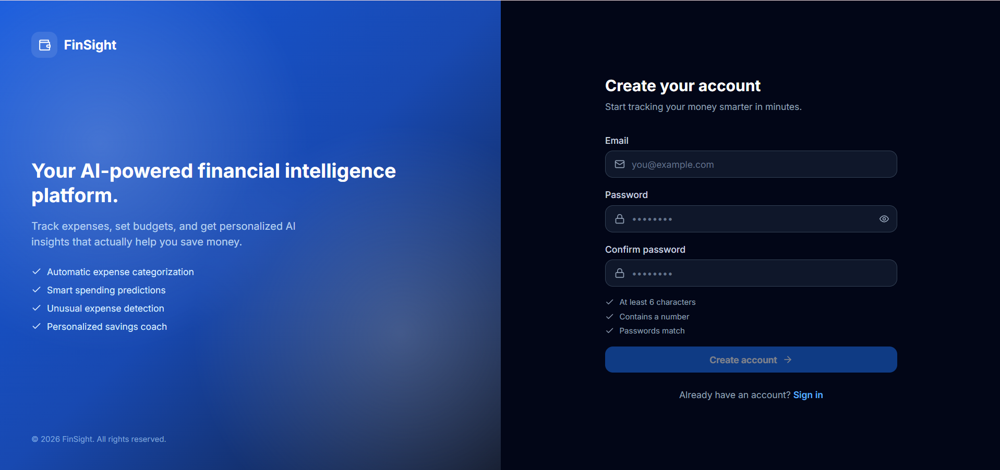
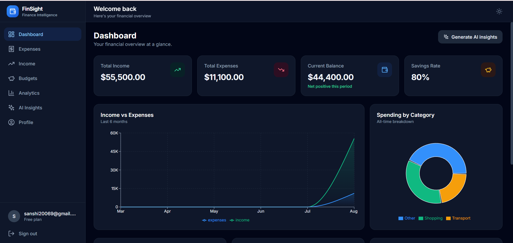
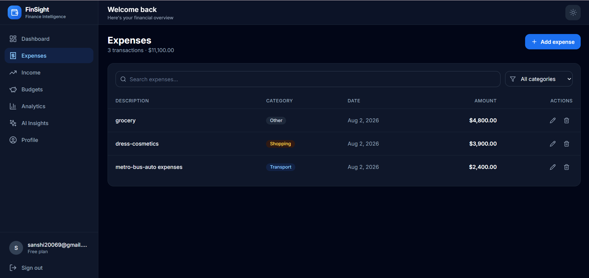
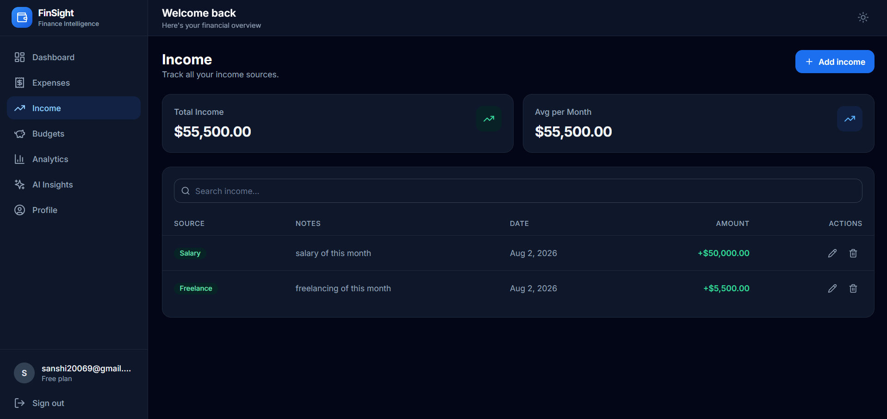
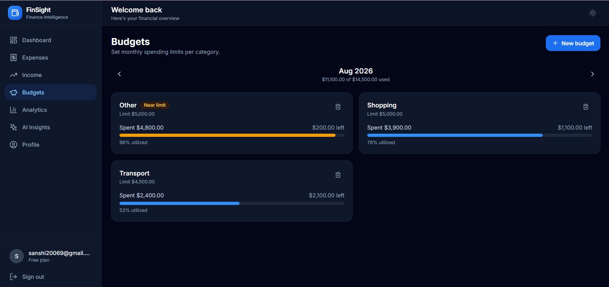
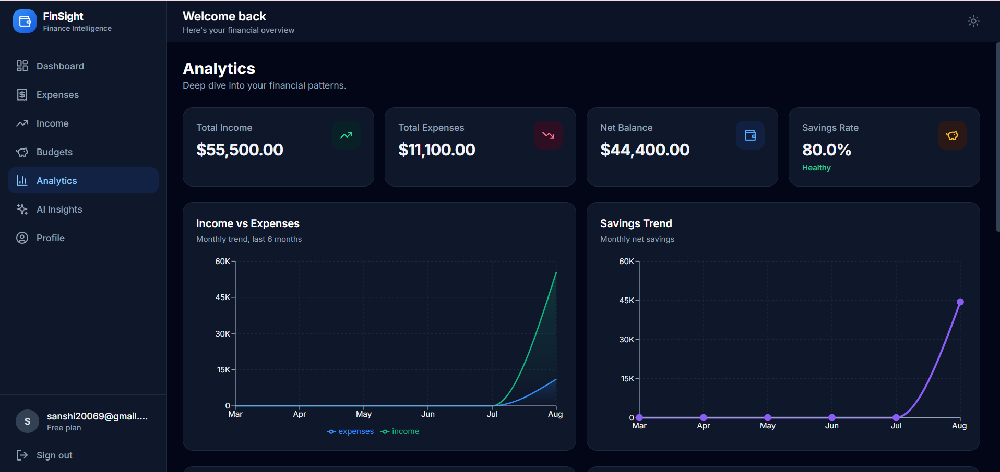
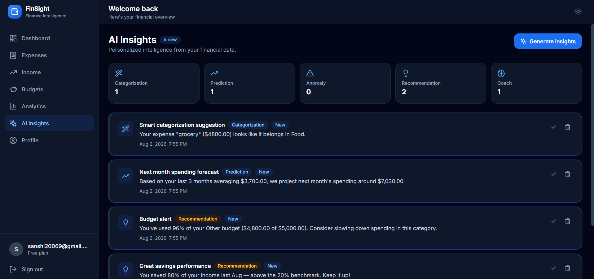
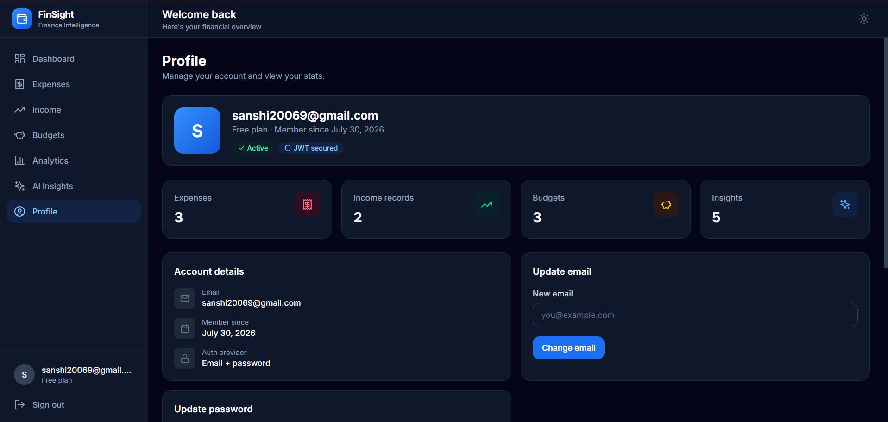

# 💰 FinSight

<div align="center">

### AI-Powered Personal Finance & Expense Intelligence Platform

Track expenses, manage budgets, visualize spending patterns, and receive AI-powered financial insights—all in one modern web application.


</div>

---

# 📖 Overview

FinSight is a full-stack personal finance platform built to simplify money management through intelligent analytics and modern design.

The application allows users to securely manage income, expenses, and monthly budgets while generating AI-powered financial insights to improve spending habits.

It provides a clean dashboard, interactive analytics, secure authentication, email verification, welcome emails, and real-time data synchronization using Supabase.

---

# ✨ Features

## 🔐 Authentication

- Secure User Registration
- Login & Logout
- Email Verification
- Welcome Email after Registration
- Persistent User Sessions
- Protected Routes

---

## 💰 Income Management

- Add Income
- Edit Income
- Delete Income
- Multiple Income Sources
- Monthly Income Tracking

---

## 💸 Expense Management

- Add Expenses
- Edit Expenses
- Delete Expenses
- Category-wise Expense Tracking
- AI-assisted Expense Categorization

---

## 📅 Budget Management

- Create Monthly Budgets
- Category-wise Budget Limits
- Budget Progress Tracking
- Spending Alerts

---

## 📊 Analytics Dashboard

- Income vs Expense Comparison
- Monthly Spending Trends
- Category-wise Expense Distribution
- Interactive Charts
- Financial Summary Cards

---

## 🤖 AI Features

- Smart Expense Categorization
- AI Financial Insights
- Spending Pattern Analysis
- Personalized Recommendations
- Financial Health Suggestions

---

## 🎨 User Experience

- Responsive Design
- Light & Dark Theme
- Modern Dashboard UI
- Toast Notifications
- Smooth Navigation

---

# 📸 Application Preview

## 🔑 Login



---

## 📊 Dashboard



---

## 💸 Expenses



---

## 💰 Income



---

## 📅 Budgets



---

## 📈 Analytics



---

## 🤖 AI Insights



---

## 👤 Profile



---

# 🛠 Tech Stack

## Frontend

- React
- TypeScript
- Vite
- Tailwind CSS
- React Router DOM
- Lucide React

## Backend

- Supabase
- Supabase Authentication
- Supabase Edge APIs

## Database

- Supabase PostgreSQL
- Row Level Security (RLS)

## AI

- AI-powered Financial Insights Engine

---

# 📂 Project Structure

```text
FinSight/
│
├── project/
│   ├── screenshots/
│   ├── src/
│   ├── supabase/
│   ├── package.json
│   ├── vite.config.ts
│   ├── tailwind.config.js
│   ├── tsconfig.json
│   └── ...
│
└── README.md
```

---

# 🚀 Getting Started

## Clone Repository

```bash
git clone https://github.com/Shivanishet/FinSight.git
```

Move into the project

```bash
cd FinSight/project
```

Install Dependencies

```bash
npm install
```

Start Development Server

```bash
npm run dev
```

---

# 🔑 Environment Variables

Create a `.env` file inside the **project** folder.

```env
VITE_SUPABASE_URL=YOUR_SUPABASE_URL

VITE_SUPABASE_ANON_KEY=YOUR_SUPABASE_ANON_KEY
```

---

# 📈 Key Highlights

- Full-Stack Web Application
- Secure Authentication
- Email Verification
- Welcome Emails
- AI-assisted Expense Categorization
- AI-generated Financial Insights
- Real-time Database
- Interactive Analytics
- Budget Management
- Responsive UI

---

# 🚀 Future Enhancements

- AI Financial Chatbot
- Voice-based Expense Entry
- OCR Receipt Scanner
- Multi-Currency Support
- Savings Goal Tracker
- Recurring Transactions
- Export Reports (PDF & Excel)
- Mobile Application

---

# 🤝 Contributing

Contributions are always welcome.

Feel free to fork this repository, improve it, and submit a pull request.

---

# 👩‍💻 Author

## Shivani Shet

Passionate Full-Stack Developer focused on building modern AI-powered web applications.

GitHub: https://github.com/Shivanishet

---

# ⭐ Support

If you found this project helpful or interesting, consider giving it a ⭐ on GitHub.

It motivates me to build more amazing projects!
